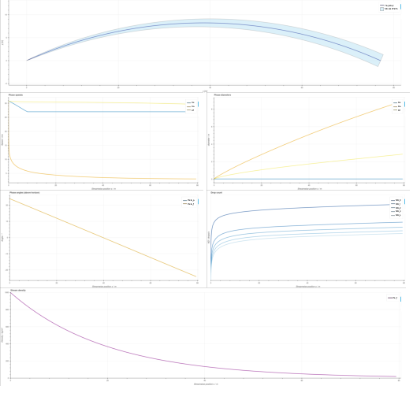

# Fire stream trajectory model — Valencia et al.

*NOTE:* Work in progress and currently not functional!
There seem to be errors in the ODE system. Example plots were generated with some of the computations bypassed.

This is a Python module for simulating the trajectories of "fire streams", i.e.,
large water jets shot from fire monitors. The backbone is a 1D Eulerian analytical
model reproduced from this publication:

```bibtex
@article{valencia_model_22,
  title = {A Model for Predicting the Trajectory and Structure of Firefighting Hose Streams},
  author = {Valencia, Andres and Zheng, Yinghui and Marshall, André W.},
  date = {2022-03-01},
  journaltitle = {Fire Technology},
  volume = {58},
  number = {2},
  pages = {793--815},
  issn = {1572-8099},
  doi = {10.1007/s10694-021-01175-1},
}
```

The model describes the fire stream as a combination of three phases: water-core phase,
air phase, and spray phase. It includes air entrainment, jet break-up spray generation
and multi-dispersion (i.e., droplets of multiple sizes).
Trajectory and spray behavior are modeled over the streamwise axis "s".



## Prerequisites

Key dependencies of this package are:
* SciPy for solving the ODE
* bokeh for plotting

To get the equations from the paper into the form expected by SciPy's `solve_ivp()` function, the `rearrange.py` script used SymPy.

## Usage

User has to supply:
- Injection angle above the horizon (between 0 and 90°)
- Injection velocity [m/s]
- simulation span (from 0 to an upper bound of the trajectory's length along s)

The core library is designed to be easily importable into other projects.
For testing purposes, a simple CLI is provided.

Example run:

``` 
cd waterjet_pred_valencia
./run_simulation.py -a 24 -s 30.8 -n 0.0254 -l 100
``` 

Run the command with the `-h` or `--help` option for a detailed usage description.

To play around with physical and model constants (e.g., the air entrainment rate alpha),
edit `model/parameters.py`.

## To-Dos

* Fix ODE system
* Compare results to original research article
* Proper Python packaging
* Use as surrogate model in Smith Predictor control
