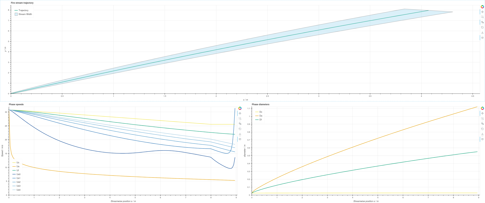

# Fire stream trajectory model — Valencia et al

**NOTE:**
Work in progress and currently not functional!
There are yet-unidentified errors in the ODE system.

---

This project simulates the trajectories of "fire streams", i.e., large water jets shot from fire monitors.
The backbone is a 1D Eulerian analytical model reproduced from this publication:

```text
@article{valencia_model_22,
  title = {A Model for Predicting the Trajectory and Structure of Firefighting Hose Streams},
  author = {Valencia, Andres and Zheng, Yinghui and Marshall, André W.},
  date = {2022-03-01},
  journaltitle = {Fire Technology},
  volume = {58},
  number = {2},
  pages = {793--815},
  issn = {1572-8099},
  doi = {10.1007/s10694-021-01175-1},
}
```

The model describes the fire stream as a combination of three phases:
water-core phase, air phase, and spray phase.
It includes air entrainment, jet break-up spray generation and multi-dispersion (i.e., droplets of multiple sizes).
Trajectory and spray behavior are modeled over the streamwise axis "s".

**Features**

- Simulates, traces, and plots evolution of trajectory, state variables, mass and momentum terms.
- Programmed defensively: simulation aborts if a physically impossible situation (e.g., a negative diameter) is detected.
- Debug mode enables live console output and auto-dropping into the Python debugger (PDB) on error.
- Tracing can be configured with different strides (e.g., one snapshot every 10 centimeters).
- Trace can be exported to CSV.
- Plots are produced as interactive HTMLs, independent of the simulation terminating successfully or due to error. 
Exception: plots are not produced when the debugger (PDB) gets activated.
- Core logic in [simulator.py](src/waterjet_pred_valencia/simulator.py) designed to be easily importable into other projects.



---

## Getting started

### Prerequisites

Key dependencies of this package are:

* [NumPy](https://numpy.org) for numerical computing.
* [SciPy](https://scipy.org) for solving the ODE.
* [bokeh](https://bokeh.org) for plotting.

Developers wishing to contribute also require:

* [pandas](https://pandas.pydata.org) for tracer output.
* [pytest](https://pytest.org) for unit tests.
* [ruff](https://docs.astral.sh/ruff) for linting.
* [SymPy](https://sympy.org) for the `rearrange.py` helper script.

### Installation

To install the package and its dependencies into your local Python environment, run:

```bash
cd /path/to/project
pip install -e .  # -e = editable
```

### Usage

To run a simulation with default parameters:

```bash
python -m waterjet-pred-valencia.cli
```

Run the command with the `-h` or `--help` option for a detailed usage description.

The most important user-supplied input parameters for running simulations are: 
* `theta_0`: injection angle above the horizon, 0–90°.
* `U_0`: injection speed [m/s].
* `s_end`: maximum value for s, i.e., the simulation limit [m].

To play around with physical and model constants (e.g., the air entrainment rate `alpha`),
edit [parameters.py](src/waterjet_pred_valencia/parameters.py).

---

## To-Dos

* Fix ODE system.
* Compare results to original research article.
* Model wind effects.
* Optimize performance.
